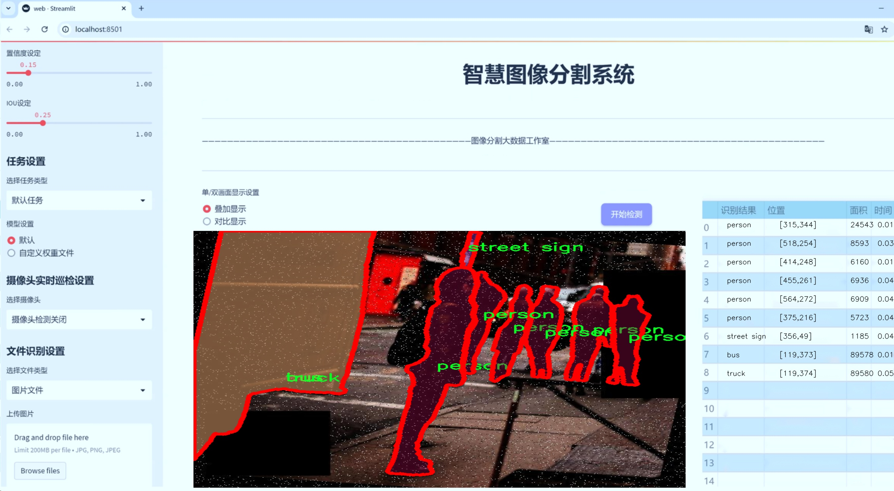
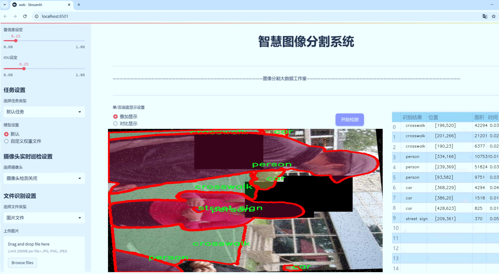
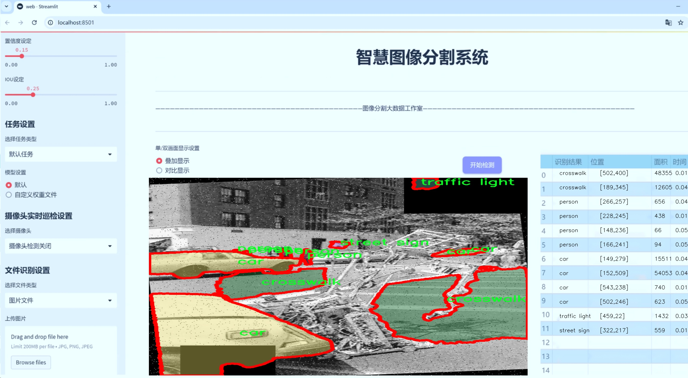
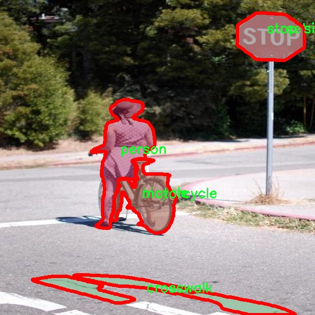
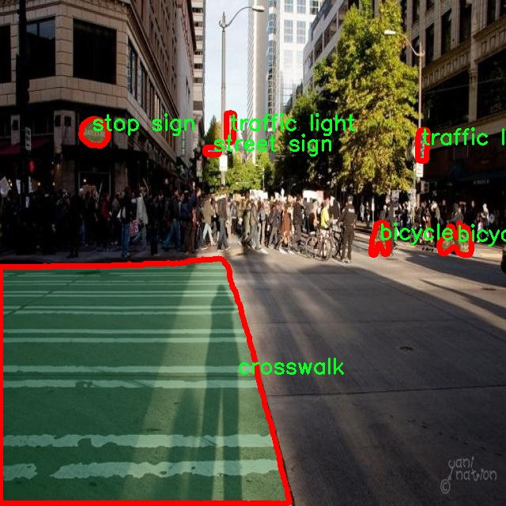
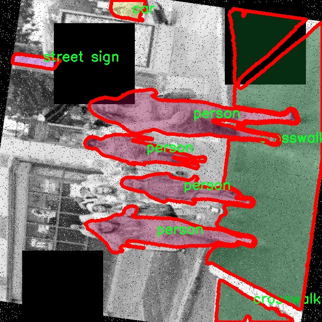
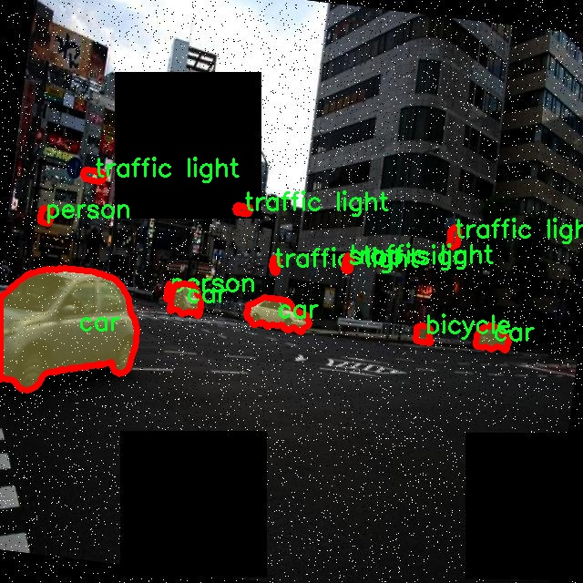
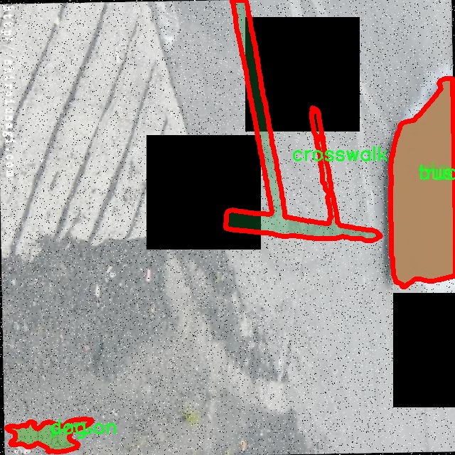

# 城市交通场景分割系统： yolov8-seg-C2f-MSBlock

### 1.研究背景与意义

[参考博客](https://gitee.com/YOLOv8_YOLOv11_Segmentation_Studio/projects)

[博客来源](https://kdocs.cn/l/cszuIiCKVNis)

研究背景与意义

随着城市化进程的加快，城市交通管理面临着前所未有的挑战。交通拥堵、交通事故频发以及环境污染等问题日益严重，亟需通过智能化手段进行有效管理与优化。在此背景下，计算机视觉技术的迅猛发展为城市交通场景的分析与处理提供了新的可能性。尤其是目标检测与分割技术的进步，使得对复杂交通场景中各种交通参与者的实时识别与分类成为可能，从而为交通管理提供了重要的数据支持。

YOLO（You Only Look Once）系列模型因其高效的实时检测能力而广受关注，尤其是YOLOv8的推出，进一步提升了目标检测的精度与速度。然而，尽管YOLOv8在多种场景下表现出色，但在复杂的城市交通环境中，尤其是涉及到多个类别的实例分割任务时，仍然存在一定的局限性。因此，基于改进YOLOv8的城市交通场景分割系统的研究显得尤为重要。

本研究所使用的数据集“crosswalk-hq-medium”包含1500张图像，涵盖了13个类别，包括自行车、公交车、汽车、人行道、狗、消防栓、摩托车、停车计时器、行人、停车标志、街道标志、交通信号灯和卡车等。这些类别的多样性为模型的训练与评估提供了丰富的样本，有助于提升模型在实际应用中的适应性与鲁棒性。通过对这些类别的实例分割，研究能够更深入地理解城市交通场景中各类对象的空间分布与相互关系，为后续的交通管理决策提供科学依据。

此外，城市交通场景的复杂性使得传统的目标检测方法往往难以应对。在这种情况下，改进YOLOv8的实例分割能力，将有助于提升模型对交通参与者的识别精度和实时性。例如，在繁忙的交叉口，行人与车辆的交互关系复杂，准确的实例分割能够有效减少交通事故的发生概率，提升交通安全。同时，精准的交通参与者识别也为智能交通系统的实施提供了数据基础，促进了智能信号控制、交通流量预测等技术的发展。

综上所述，基于改进YOLOv8的城市交通场景分割系统的研究，不仅能够推动计算机视觉技术在交通管理领域的应用，也为解决当前城市交通问题提供了新的思路与方法。通过对交通场景的深入分析与理解，研究将为实现更高效的城市交通管理体系奠定基础，助力构建安全、便捷、环保的现代城市交通环境。

### 2.图片演示







注意：本项目提供完整的训练源码数据集和训练教程,由于此博客编辑较早,暂不提供权重文件（best.pt）,需要按照6.训练教程进行训练后实现上图效果。

### 3.视频演示

[3.1 视频演示](https://www.bilibili.com/video/BV12rBWY2ECQ/)

### 4.数据集信息

##### 4.1 数据集类别数＆类别名

nc: 13
names: ['bicycle', 'bus', 'car', 'crosswalk', 'dog', 'fire hydrant', 'motorcycle', 'parking meter', 'person', 'stop sign', 'street sign', 'traffic light', 'truck']


##### 4.2 数据集信息简介

数据集信息展示

在城市交通场景分割系统的研究中，数据集的选择至关重要。为此，我们采用了名为“crosswalk-hq-medium”的数据集，以支持对YOLOv8-seg模型的改进与训练。该数据集专门设计用于城市环境中的目标检测与分割任务，涵盖了多种交通元素，旨在提高自动驾驶系统和智能交通管理的效率与安全性。

“crosswalk-hq-medium”数据集包含13个类别，分别为：自行车（bicycle）、公交车（bus）、小汽车（car）、人行横道（crosswalk）、狗（dog）、消防栓（fire hydrant）、摩托车（motorcycle）、停车计时器（parking meter）、行人（person）、停车标志（stop sign）、街道标志（street sign）、交通信号灯（traffic light）和卡车（truck）。这些类别的选择反映了城市交通场景中的常见元素，能够为模型提供丰富的上下文信息，从而提升分割精度。

数据集中每个类别的样本均经过精心标注，确保了高质量的训练数据。这些标注不仅包括物体的边界框信息，还涵盖了精确的像素级分割掩码，能够帮助模型学习到更为细致的特征。尤其是在复杂的城市环境中，物体之间的相互遮挡和背景的多样性使得目标分割任务变得更加具有挑战性。通过使用“crosswalk-hq-medium”数据集，我们能够有效地训练YOLOv8-seg模型，使其在处理这些复杂场景时表现出更高的鲁棒性和准确性。

此外，该数据集的多样性也为模型的泛化能力提供了保障。城市交通场景的多样性体现在不同的天气条件、时间段以及不同的城市布局中。“crosswalk-hq-medium”数据集包含了在各种环境下拍摄的图像，使得模型能够学习到在不同条件下的物体特征。这种多样性不仅提高了模型在训练集上的表现，也有助于其在实际应用中的适应性，确保在真实世界中能够有效识别和分割各种交通元素。

在训练过程中，我们将“crosswalk-hq-medium”数据集与YOLOv8-seg模型相结合，采用了先进的训练策略和数据增强技术，以进一步提升模型的性能。通过不断迭代和优化，我们期望最终实现一个能够在城市交通场景中高效、准确地进行目标分割的系统。这一系统不仅能够为自动驾驶车辆提供实时的环境感知能力，还能够为交通管理系统提供重要的数据支持，助力智慧城市的建设。

综上所述，“crosswalk-hq-medium”数据集在城市交通场景分割系统的研究中发挥了不可或缺的作用。它不仅为模型提供了丰富的训练样本和多样的场景信息，还为后续的研究和应用奠定了坚实的基础。通过对该数据集的深入分析与利用，我们期待在未来的工作中能够实现更高水平的交通场景理解和智能化管理。











### 5.项目依赖环境部署教程（零基础手把手教学）

[5.1 环境部署教程链接（零基础手把手教学）](https://www.bilibili.com/video/BV1jG4Ve4E9t/?vd_source=bc9aec86d164b67a7004b996143742dc)


[5.2 安装Python虚拟环境创建和依赖库安装视频教程链接（零基础手把手教学）](https://www.bilibili.com/video/BV1nA4VeYEze/?vd_source=bc9aec86d164b67a7004b996143742dc)

### 6.手把手YOLOV8-seg训练视频教程（零基础手把手教学）

[6.1 手把手YOLOV8-seg训练视频教程（零基础小白有手就能学会）](https://www.bilibili.com/video/BV1cA4VeYETe/?vd_source=bc9aec86d164b67a7004b996143742dc)


按照上面的训练视频教程链接加载项目提供的数据集，运行train.py即可开始训练



     Epoch   gpu_mem       box       obj       cls    labels  img_size
     1/200     0G   0.01576   0.01955  0.007536        22      1280: 100%|██████████| 849/849 [14:42<00:00,  1.04s/it]
               Class     Images     Labels          P          R     mAP@.5 mAP@.5:.95: 100%|██████████| 213/213 [01:14<00:00,  2.87it/s]
                 all       3395      17314      0.994      0.957      0.0957      0.0843

     Epoch   gpu_mem       box       obj       cls    labels  img_size
     2/200     0G   0.01578   0.01923  0.007006        22      1280: 100%|██████████| 849/849 [14:44<00:00,  1.04s/it]
               Class     Images     Labels          P          R     mAP@.5 mAP@.5:.95: 100%|██████████| 213/213 [01:12<00:00,  2.95it/s]
                 all       3395      17314      0.996      0.956      0.0957      0.0845

     Epoch   gpu_mem       box       obj       cls    labels  img_size
     3/200     0G   0.01561    0.0191  0.006895        27      1280: 100%|██████████| 849/849 [10:56<00:00,  1.29it/s]
               Class     Images     Labels          P          R     mAP@.5 mAP@.5:.95: 100%|███████   | 187/213 [00:52<00:00,  4.04it/s]
                 all       3395      17314      0.996      0.957      0.0957      0.0845


### 7.50+种全套YOLOV8-seg创新点加载调参实验视频教程（一键加载写好的改进模型的配置文件）

[7.1 50+种全套YOLOV8-seg创新点加载调参实验视频教程（一键加载写好的改进模型的配置文件）](https://www.bilibili.com/video/BV1Hw4VePEXv/?vd_source=bc9aec86d164b67a7004b996143742dc)

### YOLOV8-seg算法简介

原始YOLOv8-seg算法原理

YOLOv8-seg是YOLO系列模型中的一个重要版本，专注于目标检测与分割任务的结合，展现了在特征提取、目标定位和分割精度等方面的显著进步。该算法的核心理念是将目标检测与实例分割的能力整合在一起，使得模型不仅能够识别图像中的目标，还能精确地 delineate（勾勒）出目标的边界。这一特性使得YOLOv8-seg在处理复杂场景时，尤其是在需要精细分割的应用中，表现出色。

YOLOv8-seg的网络结构依然遵循YOLO系列一贯的设计思路，分为三个主要部分：Backbone、Neck和Head。Backbone负责特征提取，Neck则用于特征融合，Head则是最终的检测与分割输出。具体而言，YOLOv8-seg采用了CSPDarknet作为其主干网络，这一结构通过引入C2f模块和SPPF（快速空间金字塔池化）来增强特征提取的能力。C2f模块通过将输入特征图分为多个分支，并在每个分支中进行卷积操作，进而实现特征的多样化提取。这样的设计不仅提升了模型的表达能力，还增强了梯度流的传递，使得网络在训练过程中能够更有效地学习到有用的特征。

在特征融合方面，YOLOv8-seg继续使用FPN（特征金字塔网络）和PAN（路径聚合网络）结构，以实现多尺度特征的有效融合。通过这种方式，模型能够更好地处理不同尺寸的目标，提高了对小目标的检测能力。特别是在复杂背景下，YOLOv8-seg能够通过整合来自不同层次的特征，增强对目标的感知能力，从而提高分割的精度。

YOLOv8-seg的目标检测头采用了解耦的设计理念，分为两个独立的分支，分别负责目标的分类和定位。这种解耦结构使得模型在处理任务时更加灵活，能够针对不同的任务进行优化。分类分支和定位分支的独立处理，不仅提高了模型的准确性，还使得损失计算更加高效。YOLOv8-seg在损失函数的设计上也进行了创新，采用了Varifocal Loss作为分类损失，这种损失函数通过对正负样本进行加权，增强了模型对高质量样本的关注，进而提升了整体的检测性能。

在数据预处理方面，YOLOv8-seg继承了YOLOv5的多种增强策略，包括马赛克增强、混合增强、空间扰动和颜色扰动等。这些数据增强技术的应用，使得模型在训练过程中能够接触到更为多样化的样本，从而提高了模型的泛化能力和鲁棒性。

值得注意的是，YOLOv8-seg在标签分配策略上也进行了改进，采用了动态标签分配策略，避免了传统方法中可能出现的候选框聚类不准确的问题。这一策略使得模型在处理不同尺度的目标时，能够更加灵活地进行正负样本的匹配，从而提高了检测的精度。

综上所述，YOLOv8-seg通过对原有YOLO系列模型的多项改进，展现了在目标检测与分割任务中的强大能力。其高效的特征提取、灵活的特征融合、解耦的检测头设计以及先进的损失计算策略，使得YOLOv8-seg在处理复杂场景时，能够实现更高的准确度和更快的检测速度。随着计算机视觉技术的不断发展，YOLOv8-seg无疑将成为目标检测与分割领域的重要工具，推动相关应用的进一步发展。


### 9.系统功能展示（检测对象为举例，实际内容以本项目数据集为准）

图9.1.系统支持检测结果表格显示

  图9.2.系统支持置信度和IOU阈值手动调节

  图9.3.系统支持自定义加载权重文件best.pt(需要你通过步骤5中训练获得)

  图9.4.系统支持摄像头实时识别

  图9.5.系统支持图片识别

  图9.6.系统支持视频识别

  图9.7.系统支持识别结果文件自动保存

  图9.8.系统支持Excel导出检测结果数据


### 10.50+种全套YOLOV8-seg创新点原理讲解（非科班也可以轻松写刊发刊，V11版本正在科研待更新）

#### 10.1 由于篇幅限制，每个创新点的具体原理讲解就不一一展开，具体见下列网址中的创新点对应子项目的技术原理博客网址【Blog】：


[10.1 50+种全套YOLOV8-seg创新点原理讲解链接](https://gitee.com/qunmasj/good)

#### 10.2 部分改进模块原理讲解(完整的改进原理见上图和技术博客链接)【如果此小节的图加载失败可以通过CSDN或者Github搜索该博客的标题访问原始博客，原始博客图片显示正常】

### YOLOv8简介


由上图可以看出，C2中每个BottlNeck的输入Tensor的通道数channel都只是上一级的0.5倍，因此计算量明显降低。从另一方面讲，梯度流的增加，t也能够明显提升收敛速度和收敛效果。
C2i模块首先以输入tensor(n.c.h.w)经过Conv1层进行split拆分，分成两部分(n,0.5c,h,w)，一部分直接经过n个Bottlenck，另一部分经过每一操作层后都会以(n.0.5c,h,w)的尺寸进行Shortcut，最后通过Conv2层卷积输出。也就是对应n+2的Shortcut(第一层Conv1的分支tensor和split后的tensor为2+n个bottenlenneck)。
#### Neck
YOLOv8的Neck采用了PANet结构，如下图所示。

Backbone最后SPPF模块(Layer9)之后H、W经过32倍下采样，对应地Layer4经过8倍下采样，Layer6经过16倍下采样。输入图片分辨率为640*640，得到Layer4、Layer6、Layer9的分辨率分别为80*80、40*40和20*20。
Layer4、Layer6、Layer9作为PANet结构的输入，经过上采样，通道融合，最终将PANet的三个输出分支送入到Detect head中进行Loss的计算或结果解算。
与FPN(单向，自上而下)不同的是，PANet是一个双向通路网络，引入了自下向上的路径，使得底层信息更容易传递到顶层。
#### Head
Head部分相比Yolov5改动较大，直接将耦合头改为类似Yolo的解耦头结构(Decoupled-Head)，将回归分支和预测分支分离，并针对回归分支使用了Distribution Focal Loss策略中提出的积分形式表示法。之前的目标检测网络将回归坐标作为一个确定性单值进行预测，DFL将坐标转变成一个分布。


### LSKNet的架构
该博客提出的结构层级依次为：

LSK module（大核卷积序列+空间选择机制） < LSK Block （LK Selection + FFN）<LSKNet（N个LSK Block）


#### LSK 模块

LSK Block
LSKNet 是主干网络中的一个可重复堆叠的块（Block），每个LSK Block包括两个残差子块，即大核选择子块（Large Kernel Selection，LK Selection）和前馈网络子块（Feed-forward Network ，FFN），如图8。LK Selection子块根据需要动态地调整网络的感受野，FFN子块用于通道混合和特征细化，由一个全连接层、一个深度卷积、一个 GELU 激活和第二个全连接层组成。

LSK module（LSK 模块，图4）由一个大核卷积序列（large kernel convolutions）和一个空间核选择机制（spatial kernel selection mechanism）组成，被嵌入到了LSK Block 的 LK Selection子块中。

#### Large Kernel Convolutions
因为不同类型的目标对背景信息的需求不同，这就需要模型能够自适应选择不同大小的背景范围。因此，作者通过解耦出一系列具有大卷积核、且不断扩张的Depth-wise 卷积，构建了一个更大感受野的网络。

具体地，假设序列中第i个Depth-wise 卷积核的大小为 ，扩张率为 d，感受野为 ，它们满足以下关系：


卷积核大小和扩张率的增加保证了感受野能够快速增大。此外，我们设置了扩张率的上限，以保证扩张卷积不会引入特征图之间的差距。


Table2的卷积核大小可根据公式（1）和（2）计算，详见下图：


这样设计的好处有两点。首先，能够产生具有多种不同大小感受野的特征，便于后续的核选择；第二，序列解耦比简单的使用一个大型卷积核效果更好。如上图表2所示，解耦操作相对于标准的大型卷积核，有效地将低了模型的参数量。

为了从输入数据  的不同区域获取丰富的背景信息特征，可采用一系列解耦的、不用感受野的Depth-wise 卷积核：


其中，是卷积核为 、扩张率为  的Depth-wise 卷积操作。假设有个解耦的卷积核，每个卷积操作后又要经过一个的卷积层进行空间特征向量的通道融合。


之后，针对不同的目标，可基于获取的多尺度特征，通过下文中的选择机制动态选择合适的卷积核大小。

这一段的意思可以简单理解为：

把一个大的卷积核拆成了几个小的卷积核，比如一个大小为5，扩张率为1的卷积核加上一个大小为7，扩张率为3的卷积核，感受野为23，与一个大小为23，扩张率为1的卷积核的感受野是一样的。因此可用两个小的卷积核替代一个大的卷积核，同理一个大小为29的卷积核也可以用三个小的卷积代替（Table 2），这样可以有效的减少参数，且更灵活。

将输入数据依次通过这些小的卷积核（公式3），并在每个小的卷积核后面接上一个1×1的卷积进行通道融合（公式4）。

#### Spatial Kernel Selection
为了使模型更关注目标在空间上的重点背景信息，作者使用空间选择机制从不同尺度的大卷积核中对特征图进行空间选择。

首先，将来自于不同感受野卷积核的特征进行concate拼接，然后，应用通道级的平均池化和最大池化提取空间关系，其中， 和  是平均池化和最大池化后的空间特征描述符。为了实现不同空间描述符的信息交互，作者利用卷积层将空间池化特征进行拼接，将2个通道的池化特征转换为N个空间注意力特征图，之后，将Sigmoid激活函数应用到每一个空间注意力特征图，可获得每个解耦的大卷积核所对应的独立的空间选择掩膜，又然后，将解耦后的大卷积核序列的特征与对应的空间选择掩膜进行加权处理，并通过卷积层进行融合获得注意力特征 ，最后LSK module的输出可通过输入特征  与注意力特征  的逐元素点成获得，公式对应于结构图上的操作如下：


### 11.项目核心源码讲解（再也不用担心看不懂代码逻辑）

#### 11.1 ultralytics\utils\torch_utils.py

以下是对给定代码的核心部分进行提炼和详细注释的结果。保留了主要功能和逻辑，同时提供了中文注释以便于理解。

```python
import os
import platform
import random
import time
from contextlib import contextmanager
from pathlib import Path
import torch
import torch.nn as nn
import torch.nn.functional as F

# 选择设备，支持 CPU 和 GPU
def select_device(device='', batch=0, verbose=True):
    """
    根据提供的参数选择合适的 PyTorch 设备。

    参数:
        device (str): 设备字符串或 torch.device 对象，支持 'cpu' 或 'cuda'。
        batch (int): 模型使用的批量大小。
        verbose (bool): 是否打印设备信息。

    返回:
        torch.device: 选择的设备。
    """
    if isinstance(device, torch.device):
        return device

    device = str(device).lower()
    cpu = device == 'cpu'
    if cpu:
        os.environ['CUDA_VISIBLE_DEVICES'] = '-1'  # 强制使用 CPU
    elif device:  # 非 CPU 设备请求
        os.environ['CUDA_VISIBLE_DEVICES'] = device  # 设置环境变量
        if not (torch.cuda.is_available() and torch.cuda.device_count() >= len(device.split(','))):
            raise ValueError(f"无效的 CUDA 设备请求: {device}")

    # 优先选择 GPU
    if torch.cuda.is_available():
        return torch.device('cuda:0')
    return torch.device('cpu')

# 时间同步，确保在多 GPU 训练时的时间一致性
def time_sync():
    """确保 PyTorch 的时间同步。"""
    if torch.cuda.is_available():
        torch.cuda.synchronize()
    return time.time()

# 模型参数数量统计
def get_num_params(model):
    """返回 YOLO 模型的总参数数量。"""
    return sum(p.numel() for p in model.parameters())

# 模型信息打印
def model_info(model, verbose=True):
    """
    打印模型信息，包括层数、参数数量等。

    参数:
        model: 需要打印信息的模型。
        verbose (bool): 是否打印详细信息。
    """
    if not verbose:
        return
    n_p = get_num_params(model)  # 参数数量
    n_l = len(list(model.modules()))  # 层数
    print(f'Model summary: {n_l} layers, {n_p} parameters')

# 权重初始化
def initialize_weights(model):
    """初始化模型权重为随机值。"""
    for m in model.modules():
        if isinstance(m, nn.Conv2d):
            nn.init.kaiming_normal_(m.weight, mode='fan_out', nonlinearity='relu')
        elif isinstance(m, nn.BatchNorm2d):
            m.eps = 1e-3
            m.momentum = 0.03

# 早停机制
class EarlyStopping:
    """早停类，用于在指定的 epoch 数量内未改善时停止训练。"""

    def __init__(self, patience=50):
        """初始化早停对象。"""
        self.best_fitness = 0.0  # 最佳性能
        self.best_epoch = 0
        self.patience = patience  # 允许的未改善 epoch 数量

    def __call__(self, epoch, fitness):
        """检查是否停止训练。"""
        if fitness is None:
            return False

        if fitness >= self.best_fitness:  # 如果当前性能更好
            self.best_epoch = epoch
            self.best_fitness = fitness
        stop = (epoch - self.best_epoch) >= self.patience  # 判断是否达到早停条件
        if stop:
            print(f'停止训练，最佳性能在第 {self.best_epoch} 轮。')
        return stop

# 设置随机种子
def init_seeds(seed=0):
    """初始化随机数生成器的种子。"""
    random.seed(seed)
    torch.manual_seed(seed)
    if torch.cuda.is_available():
        torch.cuda.manual_seed_all(seed)  # 对于多 GPU

# 设备选择示例
device = select_device('cuda:0')
print(f'使用设备: {device}')

# 模型信息示例
# model = ...  # 假设这里有一个模型
# model_info(model)

# 权重初始化示例
# initialize_weights(model)

# 早停机制示例
# early_stopping = EarlyStopping(patience=10)
# for epoch in range(100):
#     fitness = ...  # 计算当前 epoch 的性能
#     if early_stopping(epoch, fitness):
#         break
```

### 说明
1. **设备选择**：`select_device` 函数用于选择合适的计算设备（CPU 或 GPU），并检查设备的可用性。
2. **时间同步**：`time_sync` 函数确保在多 GPU 训练时的时间一致性。
3. **模型信息**：`model_info` 函数打印模型的层数和参数数量。
4. **权重初始化**：`initialize_weights` 函数用于初始化模型的权重。
5. **早停机制**：`EarlyStopping` 类用于在训练过程中监控性能并在未改善时停止训练。
6. **随机种子设置**：`init_seeds` 函数用于设置随机种子，以确保结果的可重复性。

这些核心部分构成了模型训练和推理的基础功能，适用于大多数深度学习任务。

该文件 `torch_utils.py` 是 Ultralytics YOLO 项目中的一个工具模块，主要用于处理与 PyTorch 相关的各种功能。文件中包含了多个函数和类，涉及模型训练、设备选择、性能分析等方面的操作。

首先，文件导入了一些必要的库，包括数学计算、操作系统、随机数生成、时间处理、上下文管理器、深拷贝、路径处理以及类型提示等。此外，还导入了 NumPy 和 PyTorch 相关的模块，如 `torch.nn` 和 `torch.nn.functional`，以及 Ultralytics 自定义的工具和检查模块。

文件中定义了一个上下文管理器 `torch_distributed_zero_first`，用于在分布式训练中确保所有进程在本地主进程完成某些操作之前都处于等待状态。这个功能对于分布式训练的同步非常重要。

接下来是 `smart_inference_mode` 函数，它根据 PyTorch 的版本选择合适的推理模式装饰器，确保在推理时不会计算梯度，从而提高性能。

`get_cpu_info` 函数用于获取系统的 CPU 信息，返回一个字符串，包含 CPU 的品牌和架构等信息。

`select_device` 函数用于选择合适的 PyTorch 设备（CPU 或 GPU）。它根据输入的设备字符串或 `torch.device` 对象返回一个 `torch.device` 对象，并验证所请求的设备是否可用。如果选择了多个 GPU，还会检查批量大小是否能被设备数量整除。

`time_sync` 函数用于同步 CUDA 设备的时间，确保在多 GPU 环境下的时间测量准确。

`fuse_conv_and_bn` 和 `fuse_deconv_and_bn` 函数用于将卷积层和批归一化层融合，以提高模型的推理速度和效率。这种融合操作在深度学习模型中是常见的优化手段。

`model_info` 函数用于输出模型的基本信息，包括参数数量、梯度数量和层数等。如果需要详细信息，还可以输出每一层的具体参数信息。

`get_num_params` 和 `get_num_gradients` 函数分别用于计算模型的总参数数量和具有梯度的参数数量。

`model_info_for_loggers` 函数返回一个包含模型信息的字典，方便记录和日志记录。

`get_flops` 和 `get_flops_with_torch_profiler` 函数用于计算模型的浮点运算次数（FLOPs），这是评估模型复杂度和性能的重要指标。

`initialize_weights` 函数用于初始化模型的权重，确保在训练开始时权重有合适的初始值。

`scale_img` 函数用于根据给定的比例缩放和填充图像张量，以适应模型输入的要求。

`make_divisible` 函数用于返回最接近的可被指定除数整除的数，这在处理网络结构时非常有用。

`copy_attr` 函数用于从一个对象复制属性到另一个对象，可以选择性地包含或排除某些属性。

`get_latest_opset` 函数返回当前 PyTorch 版本支持的次新 ONNX opset 版本。

`intersect_dicts` 函数用于返回两个字典中具有相同形状的交集键值对。

`is_parallel` 和 `de_parallel` 函数用于检查模型是否为并行模型，并在需要时将其转换为单 GPU 模型。

`one_cycle` 函数返回一个用于生成从 y1 到 y2 的正弦波形的 lambda 函数，常用于学习率调度。

`init_seeds` 函数用于初始化随机数生成器的种子，以确保实验的可重复性。

`ModelEMA` 类实现了指数移动平均（EMA）模型的更新，用于在训练过程中保持模型参数的平滑更新。

`strip_optimizer` 函数用于从模型中去除优化器信息，以便在训练完成后保存模型。

`profile` 函数用于对模型进行速度、内存和 FLOPs 的分析，方便开发者了解模型的性能。

最后，`EarlyStopping` 类实现了早停机制，当训练在指定的轮数内没有性能提升时，停止训练以避免过拟合。

整体来看，该文件提供了多种实用的工具函数和类，帮助用户在使用 PyTorch 进行深度学习模型训练时提高效率和性能。

#### 11.2 ultralytics\trackers\utils\__init__.py

下面是代码的核心部分，并附上详细的中文注释：

```python
# Ultralytics YOLO 🚀, AGPL-3.0 license

# 导入必要的库
import torch  # 导入PyTorch库，用于深度学习模型的构建和训练

# 定义YOLO模型类
class YOLO:
    def __init__(self, model_path):
        # 初始化YOLO模型
        self.model = torch.load(model_path)  # 加载预训练的YOLO模型

    def predict(self, image):
        # 对输入图像进行预测
        with torch.no_grad():  # 在推理时不需要计算梯度
            predictions = self.model(image)  # 使用模型对图像进行预测
        return predictions  # 返回预测结果

# 使用示例
if __name__ == "__main__":
    yolo_model = YOLO('path/to/model.pt')  # 创建YOLO模型实例并加载模型
    image = torch.randn(1, 3, 640, 640)  # 创建一个随机图像作为输入
    results = yolo_model.predict(image)  # 进行预测
    print(results)  # 输出预测结果
```

### 代码注释说明：

1. **导入库**：导入了PyTorch库，这是构建和训练深度学习模型的基础。

2. **YOLO类**：定义了一个名为`YOLO`的类，用于封装YOLO模型的功能。

3. **初始化方法**：在`__init__`方法中，加载了预训练的YOLO模型。`model_path`是模型文件的路径。

4. **预测方法**：`predict`方法接收输入图像，使用模型进行预测。`torch.no_grad()`用于在推理时禁用梯度计算，以提高性能。

5. **使用示例**：在主程序中，创建了YOLO模型的实例并加载模型，生成一个随机图像作为输入，最后调用`predict`方法进行预测并输出结果。

以上是代码的核心部分和详细注释，帮助理解YOLO模型的基本使用方式。

这个文件是Ultralytics YOLO项目的一部分，主要用于目标检测和跟踪。文件名为`__init__.py`，通常在Python包中用作初始化文件。它的存在使得Python能够将包含该文件的目录视为一个包，从而可以导入该目录下的模块和子模块。

在这个特定的文件中，代码的第一行是一个注释，表明该项目使用的是AGPL-3.0许可证。这种许可证要求任何基于该代码的衍生作品也必须以相同的许可证发布，从而确保开源的精神和代码的自由使用。

虽然文件中没有其他具体的代码，但它的存在通常意味着该目录下可能会有其他模块或功能的实现，供其他部分的代码调用。通过将相关的功能模块化，Ultralytics YOLO能够更好地组织代码，提高可维护性和可重用性。

总的来说，这个`__init__.py`文件是Ultralytics YOLO项目的一部分，起到初始化包的作用，并声明了项目的许可证信息。

#### 11.3 ultralytics\data\loaders.py

以下是经过简化和注释的核心代码部分，主要集中在 `LoadStreams` 类及其相关方法上。这个类用于加载视频流并进行处理。

```python
import cv2
import numpy as np
import torch
from threading import Thread
from urllib.parse import urlparse
from pathlib import Path
import time
import math

class LoadStreams:
    """
    视频流加载器，支持多种视频流输入（如RTSP、RTMP、HTTP等）。
    """

    def __init__(self, sources='file.streams', imgsz=640, vid_stride=1, buffer=False):
        """
        初始化视频流加载器。
        
        参数:
            sources (str): 视频流源，可以是文件路径或URL。
            imgsz (int): 图像处理的大小，默认为640。
            vid_stride (int): 视频帧率步长，默认为1。
            buffer (bool): 是否缓冲输入流，默认为False。
        """
        torch.backends.cudnn.benchmark = True  # 加速固定大小推理
        self.buffer = buffer  # 设置是否缓冲输入流
        self.running = True  # 线程运行标志
        self.imgsz = imgsz  # 图像大小
        self.vid_stride = vid_stride  # 视频帧率步长
        sources = Path(sources).read_text().rsplit() if os.path.isfile(sources) else [sources]
        n = len(sources)
        self.sources = [self.clean_str(x) for x in sources]  # 清理源名称
        self.imgs, self.fps, self.frames, self.threads, self.shape = [[]] * n, [0] * n, [0] * n, [None] * n, [[]] * n
        self.caps = [None] * n  # 视频捕获对象

        for i, s in enumerate(sources):  # 遍历每个源
            st = f'{i + 1}/{n}: {s}... '
            if urlparse(s).hostname in ('www.youtube.com', 'youtube.com', 'youtu.be'):
                s = self.get_best_youtube_url(s)  # 获取最佳YouTube视频URL
            s = eval(s) if s.isnumeric() else s  # 处理数字源（如本地摄像头）
            self.caps[i] = cv2.VideoCapture(s)  # 创建视频捕获对象
            if not self.caps[i].isOpened():
                raise ConnectionError(f'{st}无法打开 {s}')
            w = int(self.caps[i].get(cv2.CAP_PROP_FRAME_WIDTH))
            h = int(self.caps[i].get(cv2.CAP_PROP_FRAME_HEIGHT))
            fps = self.caps[i].get(cv2.CAP_PROP_FPS)  # 获取帧率
            self.frames[i] = max(int(self.caps[i].get(cv2.CAP_PROP_FRAME_COUNT)), 0) or float('inf')  # 总帧数
            self.fps[i] = max((fps if math.isfinite(fps) else 0) % 100, 0) or 30  # 帧率，默认为30

            success, im = self.caps[i].read()  # 读取第一帧
            if not success or im is None:
                raise ConnectionError(f'{st}无法读取图像 {s}')
            self.imgs[i].append(im)  # 存储第一帧
            self.shape[i] = im.shape  # 存储图像形状
            self.threads[i] = Thread(target=self.update, args=([i, self.caps[i], s]), daemon=True)  # 启动线程读取帧
            self.threads[i].start()  # 启动线程
        self.bs = self.__len__()  # 设置批量大小

    def update(self, i, cap, stream):
        """在守护线程中读取视频流的帧。"""
        n, f = 0, self.frames[i]  # 帧计数器
        while self.running and cap.isOpened() and n < (f - 1):
            if len(self.imgs[i]) < 30:  # 保持最多30帧的缓冲
                n += 1
                cap.grab()  # 抓取下一帧
                if n % self.vid_stride == 0:  # 根据步长读取帧
                    success, im = cap.retrieve()
                    if not success:
                        im = np.zeros(self.shape[i], dtype=np.uint8)  # 创建空帧
                        cap.open(stream)  # 重新打开流
                    if self.buffer:
                        self.imgs[i].append(im)  # 缓冲模式下添加帧
                    else:
                        self.imgs[i] = [im]  # 非缓冲模式下替换帧
            else:
                time.sleep(0.01)  # 等待缓冲区清空

    def close(self):
        """关闭视频流加载器并释放资源。"""
        self.running = False  # 停止线程
        for thread in self.threads:
            if thread.is_alive():
                thread.join(timeout=5)  # 等待线程结束
        for cap in self.caps:  # 释放视频捕获对象
            try:
                cap.release()
            except Exception as e:
                print(f'警告: 无法释放 VideoCapture 对象: {e}')
        cv2.destroyAllWindows()  # 关闭所有OpenCV窗口

    def __iter__(self):
        """返回迭代器对象。"""
        self.count = -1
        return self

    def __next__(self):
        """返回源路径、处理后的图像和原始图像。"""
        self.count += 1
        images = []
        for i, x in enumerate(self.imgs):
            while not x:  # 等待帧可用
                if not self.threads[i].is_alive():  # 如果线程不再存活，关闭
                    self.close()
                    raise StopIteration
                time.sleep(1 / min(self.fps))  # 等待一段时间
                x = self.imgs[i]
            if self.buffer:
                images.append(x.pop(0))  # 从缓冲中取出第一帧
            else:
                images.append(x.pop(-1) if x else np.zeros(self.shape[i], dtype=np.uint8))
                x.clear()  # 清空缓冲区
        return self.sources, images, None, ''  # 返回源、图像和其他信息

    def __len__(self):
        """返回源对象的长度。"""
        return len(self.sources)  # 返回源的数量

    @staticmethod
    def clean_str(x):
        """清理字符串，去除多余空格等。"""
        return x.strip()

    @staticmethod
    def get_best_youtube_url(url):
        """获取YouTube视频的最佳质量MP4流URL。"""
        # 这里省略了具体实现
        return url  # 返回原始URL（实际代码中应进行处理）

```

### 代码说明
1. **LoadStreams 类**: 该类用于加载和处理视频流，支持多种输入源（如文件、网络流等）。
2. **__init__ 方法**: 初始化视频流加载器，设置各种参数，创建视频捕获对象，并启动线程读取视频帧。
3. **update 方法**: 在后台线程中持续读取视频帧，并将其存储在缓冲区中。
4. **close 方法**: 关闭所有打开的流和线程，释放资源。
5. **__iter__ 和 __next__ 方法**: 实现迭代器协议，允许逐帧获取视频流。
6. **clean_str 和 get_best_youtube_url 方法**: 用于清理字符串和获取YouTube视频流的最佳URL（实际实现中应进行具体处理）。

这个代码片段的核心功能是实时读取视频流并进行处理，适用于YOLO等计算机视觉任务。

这个程序文件是Ultralytics YOLO模型的一部分，主要用于加载和处理不同类型的数据源，包括视频流、图像、截图和张量。文件中定义了多个类，每个类负责处理特定类型的数据源，以下是对主要内容的详细说明。

首先，文件导入了一些必要的库，包括用于图像处理的OpenCV、NumPy、PIL，以及用于多线程处理的Thread等。接着，定义了一个数据类`SourceTypes`，用于表示不同的输入源类型，如网络摄像头、截图、图像文件和张量。

接下来是`LoadStreams`类，它负责从视频流中加载数据。该类支持多种视频流协议（如RTSP、RTMP、HTTP等），并通过多线程从流中读取帧。初始化时，它会检查输入源的有效性，并为每个源创建一个`cv2.VideoCapture`对象以捕获视频帧。类中有一个`update`方法在后台线程中运行，负责不断读取视频帧并将其存储在缓冲区中。`__next__`方法用于返回当前帧的图像数据。

`LoadScreenshots`类用于处理屏幕截图，允许用户指定捕获区域的参数（如左上角坐标和宽高）。它使用`mss`库来捕获屏幕，并将捕获的图像转换为NumPy数组。

`LoadImages`类则用于加载图像和视频文件。它支持从单个图像文件、视频文件或包含路径的文本文件中读取数据。该类会根据文件扩展名判断文件类型，并创建相应的`cv2.VideoCapture`对象以读取视频。

`LoadPilAndNumpy`类用于从PIL图像和NumPy数组中加载数据。它会验证输入图像的格式，并确保图像以NumPy数组的形式存储，便于后续处理。

`LoadTensor`类专门用于处理PyTorch张量数据。它会检查输入张量的形状，并确保其符合YOLO模型的要求。

此外，文件中还定义了一个`autocast_list`函数，用于将不同类型的输入源合并为NumPy数组或PIL图像的列表。最后，`get_best_youtube_url`函数用于从YouTube视频中提取最佳质量的MP4视频流地址。

总的来说，这个文件提供了一套完整的工具，用于加载和处理YOLO模型所需的各种输入数据，支持多种数据源类型，便于用户进行目标检测等任务。

#### 11.4 ultralytics\hub\session.py

以下是代码中最核心的部分，并附上详细的中文注释：

```python
import signal
import sys
from pathlib import Path
from time import sleep
import requests
from ultralytics.hub.utils import HUB_API_ROOT, HUB_WEB_ROOT, smart_request
from ultralytics.utils import LOGGER, __version__, checks, is_colab
from ultralytics.utils.errors import HUBModelError

AGENT_NAME = f'python-{__version__}-colab' if is_colab() else f'python-{__version__}-local'

class HUBTrainingSession:
    """
    HUB训练会话，用于Ultralytics HUB YOLO模型。处理模型初始化、心跳和检查点上传。
    """

    def __init__(self, url):
        """
        使用提供的模型标识符初始化HUBTrainingSession。

        参数:
            url (str): 用于初始化HUB训练会话的模型标识符，可以是URL字符串或特定格式的模型键。

        异常:
            ValueError: 如果提供的模型标识符无效。
            ConnectionError: 如果不支持与全局API密钥连接。
        """
        from ultralytics.hub.auth import Auth

        # 解析输入的URL
        if url.startswith(f'{HUB_WEB_ROOT}/models/'):
            url = url.split(f'{HUB_WEB_ROOT}/models/')[-1]
        if [len(x) for x in url.split('_')] == [42, 20]:
            key, model_id = url.split('_')
        elif len(url) == 20:
            key, model_id = '', url
        else:
            raise HUBModelError(f"model='{url}' not found. Check format is correct.")

        # 授权
        auth = Auth(key)
        self.model_id = model_id
        self.model_url = f'{HUB_WEB_ROOT}/models/{model_id}'
        self.api_url = f'{HUB_API_ROOT}/v1/models/{model_id}'
        self.auth_header = auth.get_auth_header()
        self.metrics_queue = {}  # 用于存储模型指标的队列
        self.model = self._get_model()  # 获取模型数据
        self.alive = True
        self._start_heartbeat()  # 启动心跳
        self._register_signal_handlers()  # 注册信号处理器
        LOGGER.info(f'查看模型: {self.model_url} 🚀')

    def _get_model(self):
        """从Ultralytics HUB获取并返回模型数据。"""
        api_url = f'{HUB_API_ROOT}/v1/models/{self.model_id}'

        try:
            response = smart_request('get', api_url, headers=self.auth_header, thread=False, code=0)
            data = response.json().get('data', None)

            if data.get('status', None) == 'trained':
                raise ValueError('模型已训练并上传。')

            if not data.get('data', None):
                raise ValueError('数据集可能仍在处理，请稍等。')

            self.model_id = data['id']  # 更新模型ID

            # 根据模型状态设置训练参数
            if data['status'] == 'new':
                self.train_args = {
                    'batch': data['batch_size'],
                    'epochs': data['epochs'],
                    'imgsz': data['imgsz'],
                    'patience': data['patience'],
                    'device': data['device'],
                    'cache': data['cache'],
                    'data': data['data']}
                self.model_file = data.get('cfg') or data.get('weights')
                self.model_file = checks.check_yolov5u_filename(self.model_file, verbose=False)
            elif data['status'] == 'training':
                self.train_args = {'data': data['data'], 'resume': True}
                self.model_file = data['resume']

            return data
        except requests.exceptions.ConnectionError as e:
            raise ConnectionRefusedError('ERROR: HUB服务器未在线，请稍后再试。') from e
        except Exception:
            raise

    @threaded
    def _start_heartbeat(self):
        """开始一个线程心跳循环，向Ultralytics HUB报告代理状态。"""
        while self.alive:
            r = smart_request('post',
                              f'{HUB_API_ROOT}/v1/agent/heartbeat/models/{self.model_id}',
                              json={'agent': AGENT_NAME},
                              headers=self.auth_header,
                              retry=0,
                              code=5,
                              thread=False)  # 已在一个线程中
            sleep(300)  # 每300秒发送一次心跳
```

### 代码说明：
1. **导入模块**：导入必要的模块和库，包括信号处理、路径操作、时间处理和HTTP请求。
2. **AGENT_NAME**：根据当前环境（Colab或本地）设置代理名称。
3. **HUBTrainingSession类**：主要类，用于管理与Ultralytics HUB的训练会话。
   - **初始化方法**：解析模型标识符，进行授权，获取模型数据，启动心跳和注册信号处理器。
   - **_get_model方法**：从Ultralytics HUB获取模型数据，并根据模型状态设置训练参数。
   - **_start_heartbeat方法**：在一个线程中循环发送心跳，报告代理状态。

这个程序文件定义了一个名为 `HUBTrainingSession` 的类，主要用于管理与 Ultralytics HUB 的 YOLO 模型训练会话。该类负责模型的初始化、心跳检测和检查点上传等功能。

在初始化方法 `__init__` 中，程序首先解析传入的模型标识符 `url`，确保其格式正确。如果 `url` 是以 Ultralytics HUB 的模型网址开头，则提取出模型的关键部分。接着，程序会创建一个 `Auth` 实例以进行身份验证，并设置一些属性，包括模型的 URL、API URL、身份验证头、速率限制、定时器、模型数据队列等。然后，调用 `_get_model` 方法从 HUB 获取模型数据，并启动心跳检测。

`_register_signal_handlers` 方法用于注册信号处理程序，以便在接收到终止信号时能够优雅地关闭程序。`_handle_signal` 方法处理这些信号，停止心跳并退出程序。

`upload_metrics` 方法用于将模型的性能指标上传到 Ultralytics HUB。它会构建一个包含指标的有效负载，并通过 `smart_request` 方法发送 POST 请求。

`_get_model` 方法负责从 Ultralytics HUB 获取模型数据。它会检查模型的状态，并根据状态决定是开始新的训练还是恢复已有的训练。如果模型状态为“新”，则提取训练参数；如果状态为“训练中”，则准备恢复训练。

`upload_model` 方法用于将模型的检查点上传到 Ultralytics HUB。它会检查权重文件是否存在，并根据是否为最佳模型或最终模型来构建上传请求。

最后，`_start_heartbeat` 方法启动一个线程，定期向 Ultralytics HUB 发送心跳请求，以报告代理的状态。这个方法会在类实例存活时持续运行，并使用 `smart_request` 方法发送 POST 请求。

总体而言，这个文件实现了与 Ultralytics HUB 进行交互的基本功能，确保模型训练过程中的数据上传和状态监控。

#### 11.5 chinese_name_list.py

以下是代码的核心部分，并附上详细的中文注释：

```python
# -*- coding: utf-8 -*-  # 指定文件编码为UTF-8，以支持中文字符

# 创建一个字典，键为'person'，值为中文'人'
Chinese_name = {'person': "人"}

# 从字典中提取所有值，生成一个列表
Label_list = list(Chinese_name.values())
```

### 注释说明：
1. `# -*- coding: utf-8 -*-`：这行代码指定了文件的编码格式为UTF-8，以确保能够正确处理和显示中文字符。
2. `Chinese_name = {'person': "人"}`：定义一个字典`Chinese_name`，其中包含一个键值对，键为`'person'`，对应的值为中文字符`"人"`。
3. `Label_list = list(Chinese_name.values())`：使用`values()`方法从字典中提取所有的值，并将其转换为列表，赋值给`Label_list`。此时，`Label_list`将包含字典中的所有中文名称。

这个程序文件的名称是 `chinese_name_list.py`，它的主要功能是定义一个包含中文名称的字典，并从中提取出值列表。

首先，文件的第一行 `# -*- coding: utf-8 -*-` 是一个编码声明，表示这个文件使用 UTF-8 编码格式。这对于处理中文字符非常重要，因为它确保了中文字符能够被正确识别和显示。

接下来，定义了一个字典 `Chinese_name`，其中包含一个键值对。键是字符串 `"person"`，对应的值是中文字符 `"人"`。这个字典的目的是存储中文名称及其对应的英文标识。

然后，使用 `list(Chinese_name.values())` 这一行代码从字典中提取出所有的值，并将它们转换成一个列表。这里，`Chinese_name.values()` 方法返回字典中所有值的视图，而 `list()` 函数则将这个视图转换为一个列表。最终，提取出的值被存储在变量 `Label_list` 中。

综上所述，这个程序的核心功能是创建一个包含中文名称的字典，并将这些名称以列表的形式存储，方便后续使用。

### 12.系统整体结构（节选）

### 整体功能和构架概括

该项目是Ultralytics YOLO模型的实现，主要用于目标检测和跟踪。项目的整体架构分为多个模块，每个模块负责特定的功能，以提高代码的可维护性和可重用性。主要模块包括数据加载、模型训练、工具函数、与Ultralytics HUB的交互等。通过这些模块，用户可以方便地进行模型训练、数据处理和性能监控。

以下是各个文件的功能整理表：

| 文件路径                                         | 功能描述                                                         |
|--------------------------------------------------|------------------------------------------------------------------|
| `ultralytics/utils/torch_utils.py`              | 提供与PyTorch相关的工具函数和类，包括设备选择、模型信息、权重初始化等。 |
| `ultralytics/trackers/utils/__init__.py`       | 初始化包，声明许可证信息，允许导入该目录下的模块。               |
| `ultralytics/data/loaders.py`                   | 定义数据加载类，支持从视频流、图像、截图和张量等多种数据源加载数据。  |
| `ultralytics/hub/session.py`                    | 管理与Ultralytics HUB的训练会话，包括模型上传、心跳检测和状态监控。   |
| `chinese_name_list.py`                           | 定义一个包含中文名称的字典，并提取出名称列表。                   |

通过这些模块的协同工作，Ultralytics YOLO项目能够高效地进行目标检测和跟踪任务，同时提供了良好的用户体验和灵活性。

### 13.图片、视频、摄像头图像分割Demo(去除WebUI)代码

在这个博客小节中，我们将讨论如何在不使用WebUI的情况下，实现图像分割模型的使用。本项目代码已经优化整合，方便用户将分割功能嵌入自己的项目中。
核心功能包括图片、视频、摄像头图像的分割，ROI区域的轮廓提取、类别分类、周长计算、面积计算、圆度计算以及颜色提取等。
这些功能提供了良好的二次开发基础。

### 核心代码解读

以下是主要代码片段，我们会为每一块代码进行详细的批注解释：

```python
import random
import cv2
import numpy as np
from PIL import ImageFont, ImageDraw, Image
from hashlib import md5
from model import Web_Detector
from chinese_name_list import Label_list

# 根据名称生成颜色
def generate_color_based_on_name(name):
    ......

# 计算多边形面积
def calculate_polygon_area(points):
    return cv2.contourArea(points.astype(np.float32))

...
# 绘制中文标签
def draw_with_chinese(image, text, position, font_size=20, color=(255, 0, 0)):
    image_pil = Image.fromarray(cv2.cvtColor(image, cv2.COLOR_BGR2RGB))
    draw = ImageDraw.Draw(image_pil)
    font = ImageFont.truetype("simsun.ttc", font_size, encoding="unic")
    draw.text(position, text, font=font, fill=color)
    return cv2.cvtColor(np.array(image_pil), cv2.COLOR_RGB2BGR)

# 动态调整参数
def adjust_parameter(image_size, base_size=1000):
    max_size = max(image_size)
    return max_size / base_size

# 绘制检测结果
def draw_detections(image, info, alpha=0.2):
    name, bbox, conf, cls_id, mask = info['class_name'], info['bbox'], info['score'], info['class_id'], info['mask']
    adjust_param = adjust_parameter(image.shape[:2])
    spacing = int(20 * adjust_param)

    if mask is None:
        x1, y1, x2, y2 = bbox
        aim_frame_area = (x2 - x1) * (y2 - y1)
        cv2.rectangle(image, (x1, y1), (x2, y2), color=(0, 0, 255), thickness=int(3 * adjust_param))
        image = draw_with_chinese(image, name, (x1, y1 - int(30 * adjust_param)), font_size=int(35 * adjust_param))
        y_offset = int(50 * adjust_param)  # 类别名称上方绘制，其下方留出空间
    else:
        mask_points = np.concatenate(mask)
        aim_frame_area = calculate_polygon_area(mask_points)
        mask_color = generate_color_based_on_name(name)
        try:
            overlay = image.copy()
            cv2.fillPoly(overlay, [mask_points.astype(np.int32)], mask_color)
            image = cv2.addWeighted(overlay, 0.3, image, 0.7, 0)
            cv2.drawContours(image, [mask_points.astype(np.int32)], -1, (0, 0, 255), thickness=int(8 * adjust_param))

            # 计算面积、周长、圆度
            area = cv2.contourArea(mask_points.astype(np.int32))
            perimeter = cv2.arcLength(mask_points.astype(np.int32), True)
            ......

            # 计算色彩
            mask = np.zeros(image.shape[:2], dtype=np.uint8)
            cv2.drawContours(mask, [mask_points.astype(np.int32)], -1, 255, -1)
            color_points = cv2.findNonZero(mask)
            ......

            # 绘制类别名称
            x, y = np.min(mask_points, axis=0).astype(int)
            image = draw_with_chinese(image, name, (x, y - int(30 * adjust_param)), font_size=int(35 * adjust_param))
            y_offset = int(50 * adjust_param)

            # 绘制面积、周长、圆度和色彩值
            metrics = [("Area", area), ("Perimeter", perimeter), ("Circularity", circularity), ("Color", color_str)]
            for idx, (metric_name, metric_value) in enumerate(metrics):
                ......

    return image, aim_frame_area

# 处理每帧图像
def process_frame(model, image):
    pre_img = model.preprocess(image)
    pred = model.predict(pre_img)
    det = pred[0] if det is not None and len(det)
    if det:
        det_info = model.postprocess(pred)
        for info in det_info:
            image, _ = draw_detections(image, info)
    return image

if __name__ == "__main__":
    cls_name = Label_list
    model = Web_Detector()
    model.load_model("./weights/yolov8s-seg.pt")

    # 摄像头实时处理
    cap = cv2.VideoCapture(0)
    while cap.isOpened():
        ret, frame = cap.read()
        if not ret:
            break
        ......

    # 图片处理
    image_path = './icon/OIP.jpg'
    image = cv2.imread(image_path)
    if image is not None:
        processed_image = process_frame(model, image)
        ......

    # 视频处理
    video_path = ''  # 输入视频的路径
    cap = cv2.VideoCapture(video_path)
    while cap.isOpened():
        ret, frame = cap.read()
        ......
```


### 14.完整训练+Web前端界面+50+种创新点源码、数据集获取


# [下载链接：https://mbd.pub/o/bread/Z5ial5pw](https://mbd.pub/o/bread/Z5ial5pw)